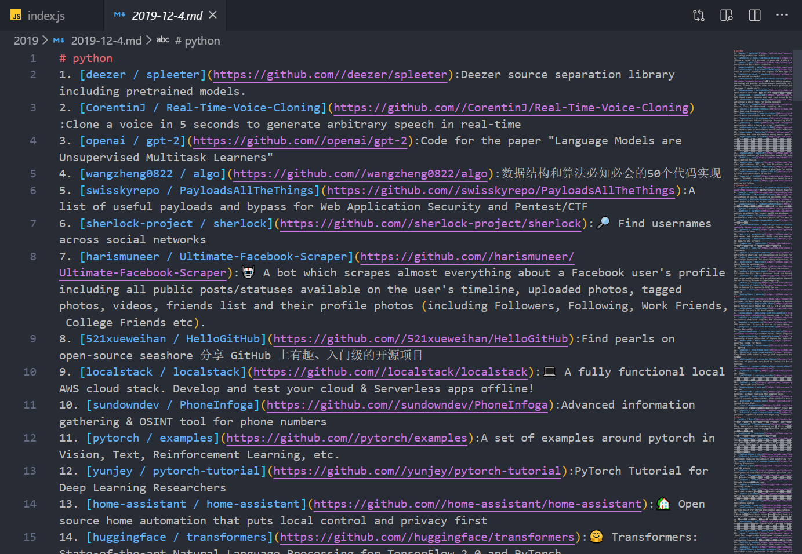

# GitHub Trending(node.js)

## Intro

Tracking the most popular Github repos(node.js version)

inspired by [GitHub Trending(Python)](https://github.com/bonfy/github-trending)

## Run

```bash
$ set DEBUG=repo:*  # 设置debug windows用set

$ git clone git@github.com:xunzhanggzl/github_trending.git

$ npm i

$ node index.js
```

## image



# 留存

可以考虑一下node的输入